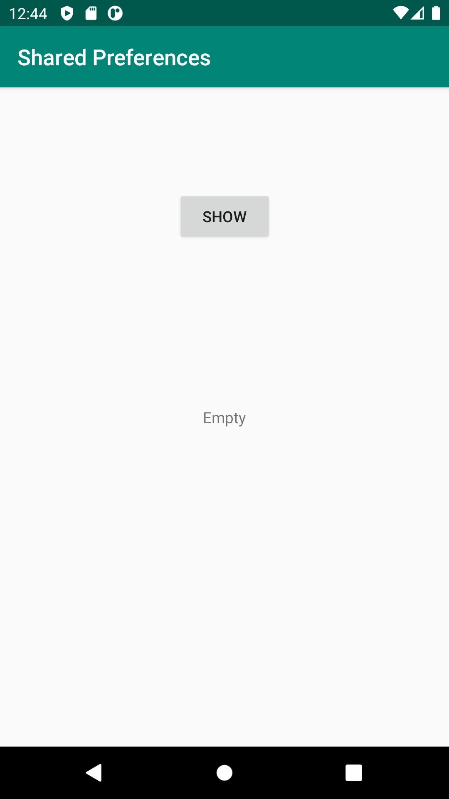
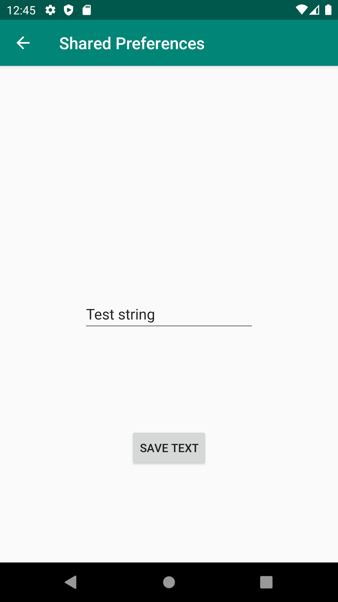
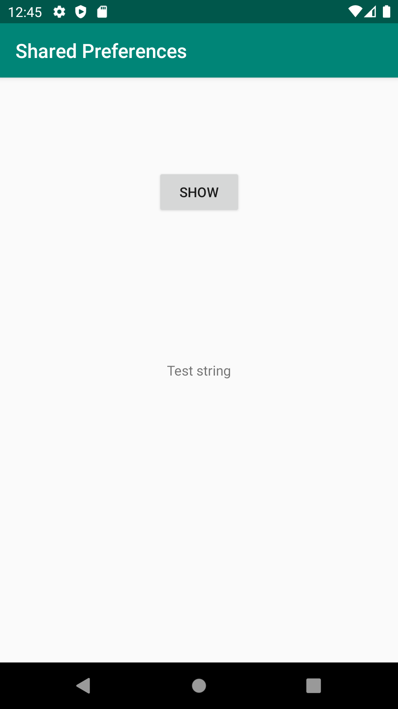

# Rapport

En activity som kallas `SecondActivity` implementerades. Denna activity använder `activity_second.xml` för layout och `SecondActivity.java` för att exekvera java-kod. I `MainActivity` implementerades två widgets, en `Button` och `TextView`. Knappen öppnar `SecondActivity` genom att använda `intents`. I `SecondActivity` implementerades en `EditText` och `Button` widget. `EditText` används att för ta emot inmatning av text, medans knappen används för att spara texten till en `SharePreference` instans.

I `SecondActivity` så kan texten som matats in till `EditText` widget:en sparas genom att trycka på en knapp. Då användaren trycker på knappen så exekveras metoden `SaveToPref()`, som sparar den inmatade texten i `EditText` till en `SharedPreference` instans genom att använda en `SharedPreference.Editor`. Nedan visas ett kodstycke för metoden.

```java
    public void saveToPref(View v){
        sharedPreferenceEditor.putString("SharedPreferenceString",editText.getText().toString());
        sharedPreferenceEditor.apply();
    }
```

För att kunna hämta texten som sparats till `SharedPreferences` så används en privat attribut av typen `SharedPreferences `i `MainActivity` identifierad som `sharedPreferenceRef`. Metoden `onResume()` används för att hämta texten från `sharedPreferenceRef` med `key-value` "SharedPreferenceString" (se kodstycket nedan). Fortsättningsvis så används den hämtade texten för att bestämma texten för den `TextView` widget som lagts till i `MainActivity`.

```java
    public void onResume() {
        super.onResume();
        textView.setText(sharedPreferenceRef.getString("SharedPreferenceString","Empty"));
    }

```

Nästa gång användaren navigerar till `SecondActivity` så kommer även `EditText` widget:en fyllas med den text som senast sparats i `SharedPreference` objektet. Detta utförs på samma sätt som för `TextView`:en i `MainActivity`, genom användning av `onResume` metoden (se kodstycket nedan).

```java
    public void onResume() {
        super.onResume();
        editText.setText(sharedPreferenceRef.getString("SharedPreferenceString",""));
    }
```

Nedan visas tre bilder där `SharedPreference` först inte innehåller något sparat värde och `MainActivity` visar strängen "Empty". Fortsättningsvis visar den andra bilden att en text sparas till `SharedPreferences` i `SecondActivity`, som sedan visas i `MainActivity` i den tredje bilden. 

<figure align="center">
    
    <figcaption align="center"><b>MainAcitivty: SharedPreference har inget sparat värde</b></figcaption>
</figure>
<figure align="center">

    <figcaption align="center"><b>SecondAcitivty: String sparas till SharedPreference</b></figcaption>
</figure>
<figure align="center">

    <figcaption align="center"><b>MainAcitivty: String från SharedPreference visas</b></figcaption>
</figure>
